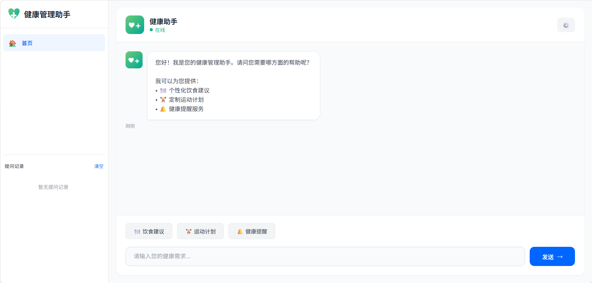

健康管理助手——自定义AI智能体
项目简介
本项目基于字节跳动TraeCN AI原生IDE开发，搭建专属健康管理智能体，结合RAG检索增强技术与智谱GLM-4-Flash大模型，实现饮食建议、运动计划、健康提醒三大核心问答功能。项目全程使用TraeCN完成智能体配置、代码生成、调试与流程编排。
技术栈
1.开发平台：TraeCN（自定义Agent、工作流编排、上下文管理、AI辅助编码）
2.编程语言&框架：Python、Flask AI技术：RAG检索增强、用户意图识别、大模型API
3.调用其他：JSON知识库、HTML+JavaScript 前端交互
核心功能
1.饮食建议：提供减脂、增肌、均衡饮食等个性化食谱方案
2.运动计划：适配新手/进阶人群的科学健身规划
3.健康提醒：饮水、休息、护眼、服药等日常健康提醒
4.特色机制：本地知识库极速响应、大模型复杂问答兜底、多轮对话上下文保持
TraeCN 平台应用亮点
1.自定义智能体：在TraeCN中完成Agent配置、意图关键词库、插件调用规则设置；
2.工作流编排：依托平台工作流引擎，拆分三大业务模块，实现流程自动化流转；
3.AI协同开发：使用平台代码生成、调试、重构能力，提升开发与排错效率；
4.上下文管理：借助平台原生能力实现多轮对话追踪，保证对话连贯性。
项目亮点
1.双响应链路：常规问题调用本地知识库（响应＜0.1s），复杂问题调用大模型；
2.模块化架构：代码解耦，依托TraeCN易扩展、易维护；
3.完整工程化：包含前后端代码、知识库、配置文件、全套课程设计文档，可一键部署。
📸TraeCN 开发界面

